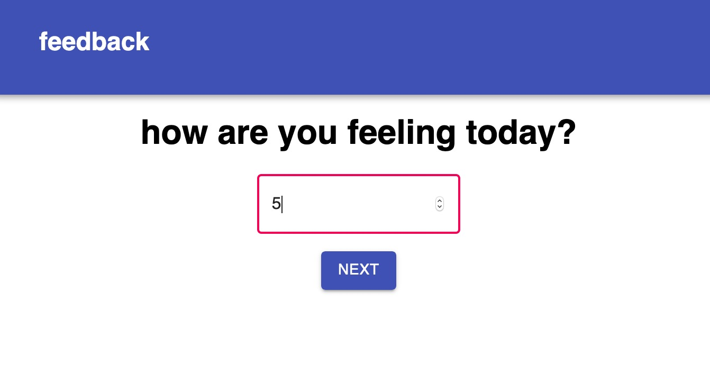
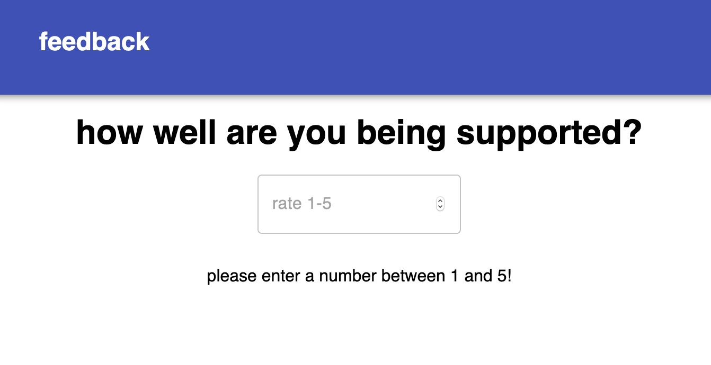
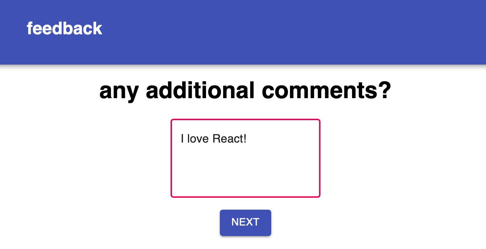
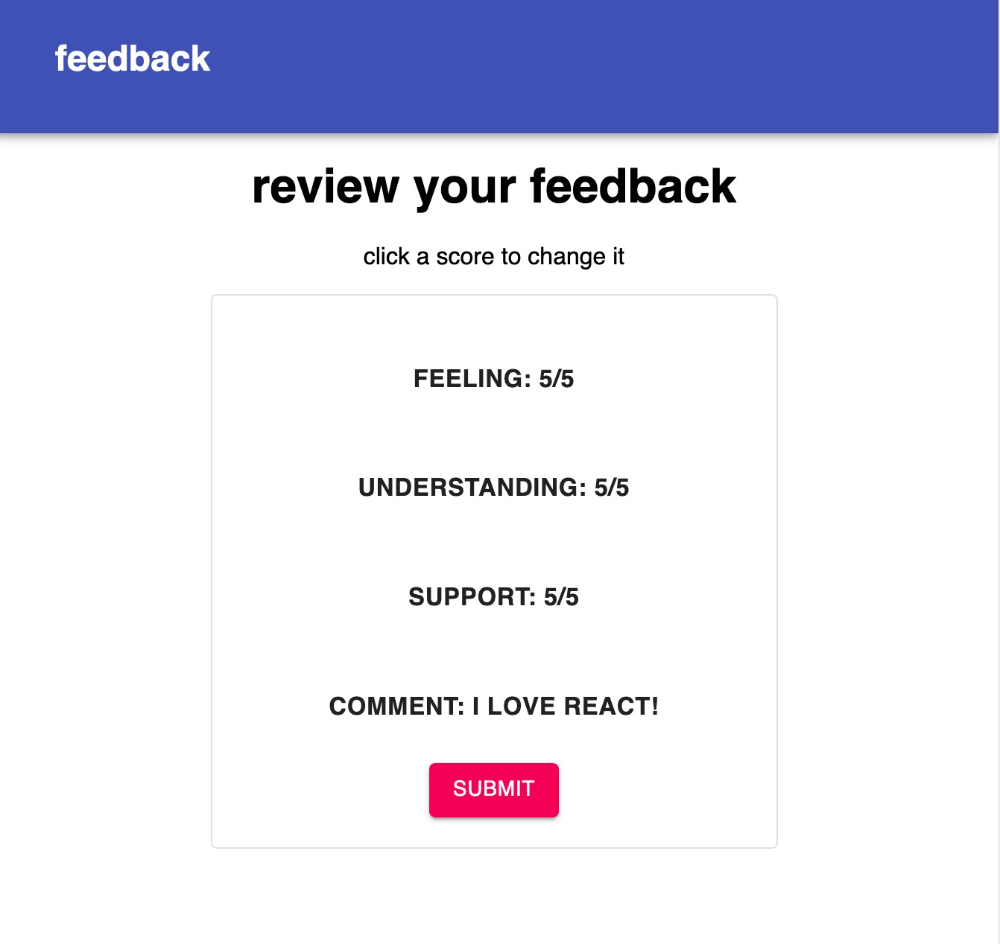

# Feedback App

## To get started:
### Install:
`npm install`

`npm install redux react-redux` 

`npm install react-router-dom`

Create Database "prime_feedback" with data.sql file

### To Run:
`npm run server`

`npm run client`

---

## Description

This app collects feedback from participants with a neat ui and stores it in a database. Each input field requires either a number 1-5 or text. At the end, users can review the feedback they entered and revisit anything they may want to change.

--- 
## Screenshots

Input must be between 1 and 5 for button to appear.

Comments field is optional.

Each category of feedback is a button that leads back to that page. Submit button serves alert thanking user for feedback and sends it to the database.